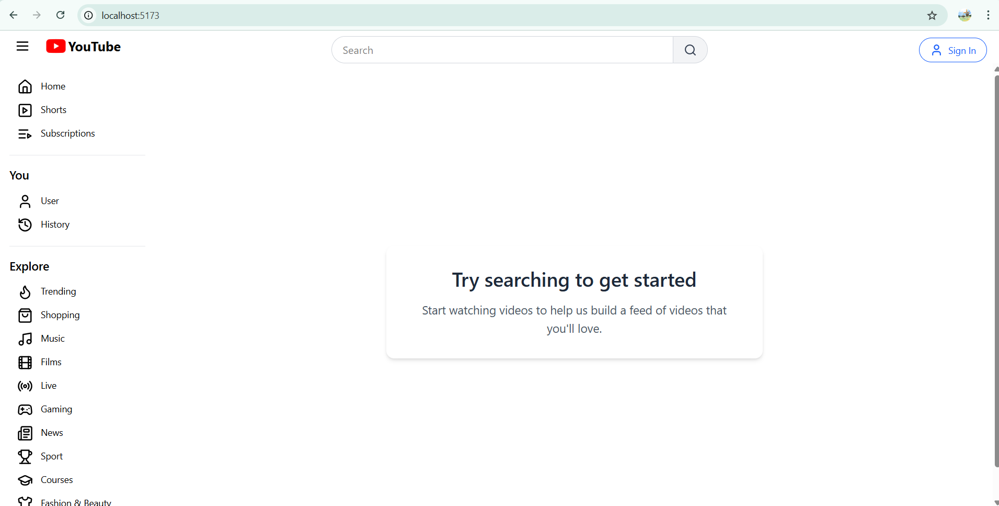
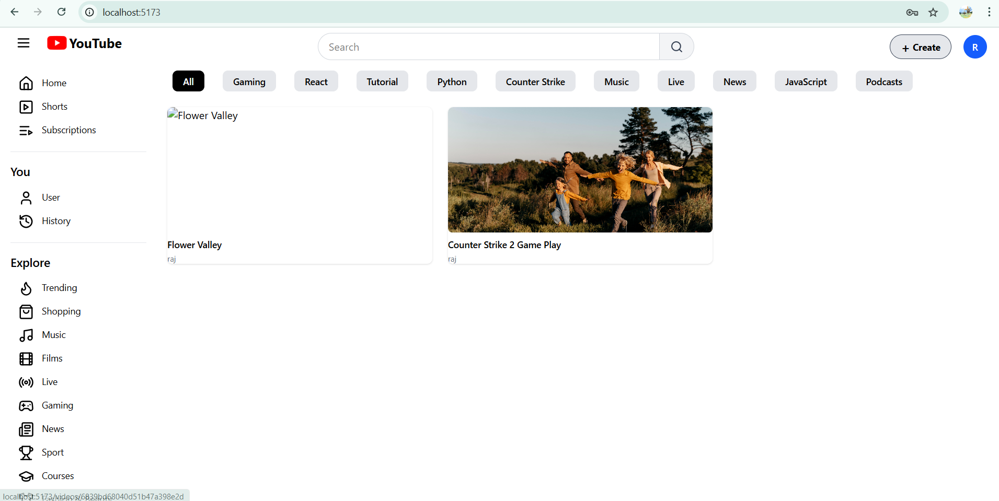
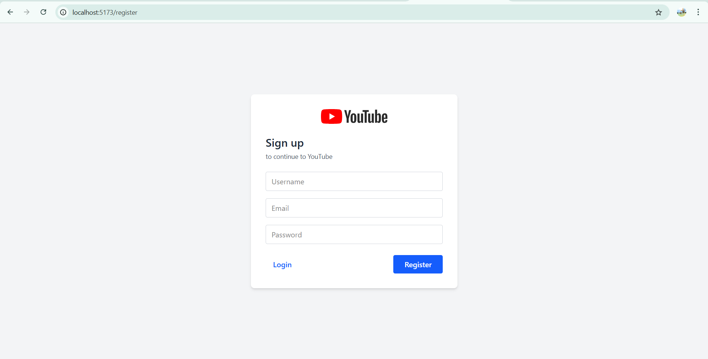
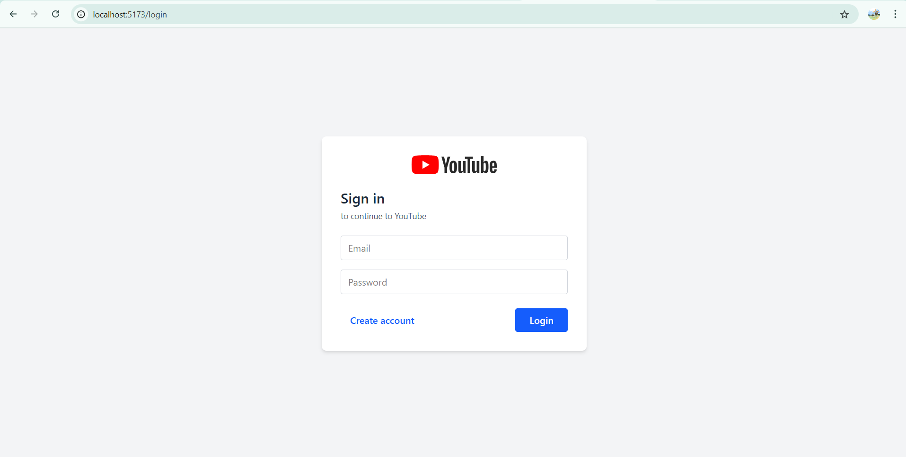
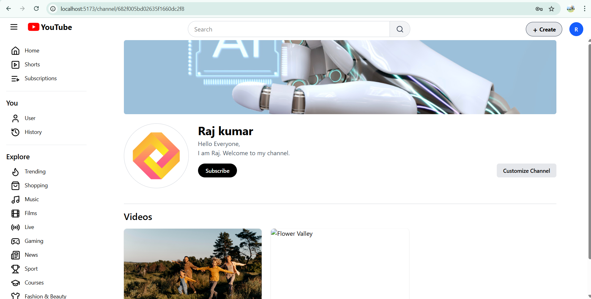
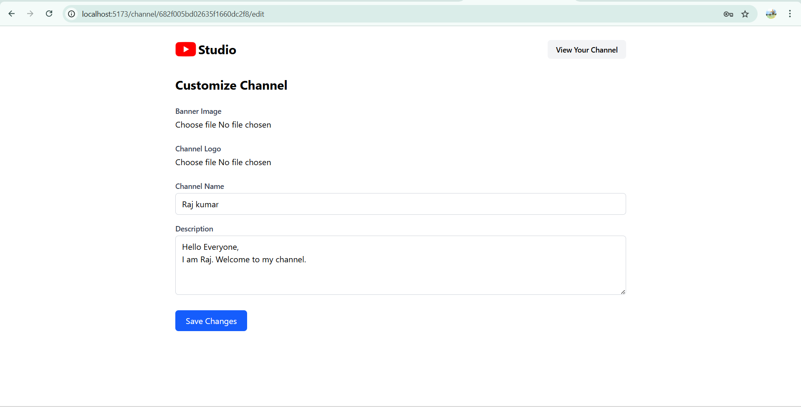
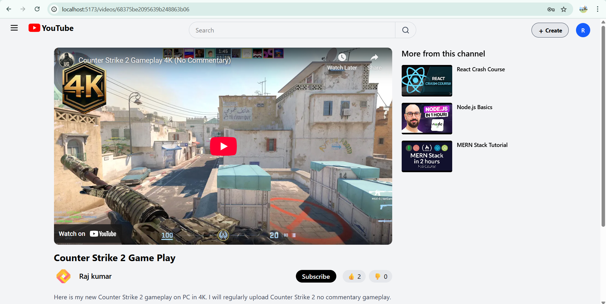
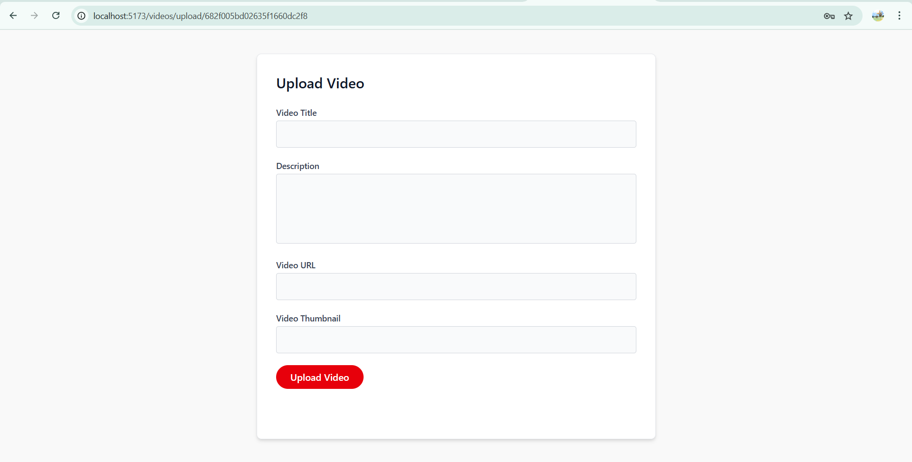

# YouTube Project

## Before Login

This is the view of the project before login:



---

## After Login

Page after User login:



---

## Register Page

This is Register Page:



---

## Login Page

This is Login Page:



---

## Channel Page

This is user Channel Page:



---

## Customize Page

User Channel Customization Page:



---

## Video Page

This is Video Page:



---

## Upload Video Page

This is Vieo Upload Page:



---

## 🛠️ Getting Started

### 📦 Clone the repository

```bash
git clone https://github.com/S-Trivedii/Internshala-YouTube-Clone.git
cd Internshala-YouTube-Clone

```

### ⚙️ Setting up the project locally

1. Install dependencies for both client and server:

```bash
# For client
cd client
npm install

# For server
cd ../server
npm install
```

2. Create a .env file inside server. Below is an example setup:

   🔐 server/.env

   ```env
   PORT=8000
   MONGO_URI=your_mongodb_connection_string
   JWT_SECRET=your_jwt_secret
   NODE_ENV=your_environment
   CLOUDINARY_CLOUD_NAME=your_cloud_name
   CLOUDINARY_API_KEY=your_api_key
   CLOUDINARY_API_SECRET=your_api_secret

   ```

3. Start the development servers

```bash
# In one terminal - start the server
cd server
npm run dev

# In another terminal - start the client
cd client
npm run dev
```

✅ You're all set!
Visit http://localhost:5173 (or the port Vite shows) to view the app.

🎥 Watch Demo Video: [Click here to watch](https://drive.google.com/file/d/1DT8IiJ_uIFntwdh4topqjVZ8eet87LIf/view?usp=sharing)
